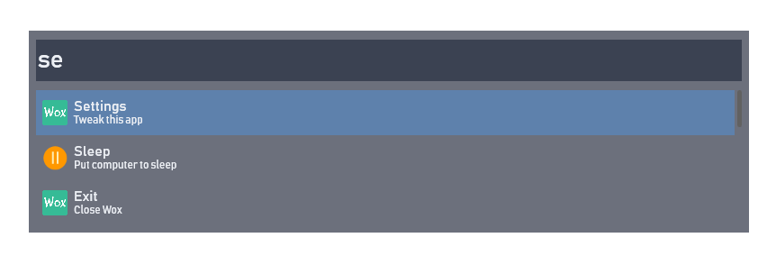

# Nord WOX

An arctic, north-bluish clean and elegant minimal WOX UI.  
Based on the <a href="https://github.com/arcticicestudio/nord">Nord</a> color palette. 

## Preview

## Getting started
**Installation**
  1. Download [last release theme](https://github.com/Findoss/Nord-WOX/releases) or build from source 
  2. Install `Nord.xaml` in path ``%USER%\AppData\Local\Wox\app-X.X.XXX\Themes``

**Activation**
  1. Open Settings → Theme
  2. Select `Nord`
  3. Select font `Bahnschrift`

## Contributing
Please read [CONTRIBUTING.md](https://github.com/Findoss/Nord-WOX/CONTRIBUTING.md) for details on our code of conduct, and the process for submitting pull requests to us.

## Authors
 * Nikita Stroganov - Initial work

## License
[MIT](https://github.com/Findoss/Nord-WOX/LICENSE). Copyright (c) Findoss.
